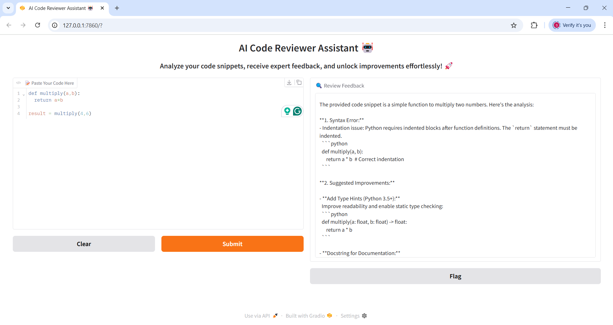

# AI Code Reviewer Assistant with DeepSeek-R1 and Gradio 🤖

An interactive AI-powered assistant leveraging DeepSeek-R1 to provide insightful code reviews through a user-friendly interface.
---

## Prerequisites and Setup Instructions 🚀

### **1. Install Python** 🐍

Ensure Python 3.11 or later is installed. If Python is not already installed, follow these steps:

- For a detailed guide on how to install Python on different operating systems, refer to the [Quick Guide for Installing Python](https://github.com/PackeTsar/Install-Python/blob/master/README.md#install-python-).
- The latest version of Python can be downloaded from the official website: [Download Python](https://www.python.org/downloads/).

Verify the installation:

```bash
python --version
```

### **2. Create a Virtual Environment** 💻

Creating a virtual environment is recommended to manage dependencies for the project.

- **For Windows**:
    ```bash
    python -m venv venv
    ```

- **For MacOS/Linux**:
    ```bash
    python3 -m venv venv
    ```

### **3. Activate the Virtual Environment** 🔑

After creating the virtual environment, it needs to be activated:

- **For Windows**:
    ```bash
    venv\Scripts\activate
    ```

- **For MacOS/Linux**:
    ```bash
    source venv/bin/activate
    ```

After activation, the terminal prompt should display `(venv)` at the beginning.

### **4. Install Project Dependencies** 📦

Install the required libraries listed in the `requirements.txt` file:

```bash
pip install -r requirements.txt
```

For MacOS/Linux, use `pip3` if necessary:

```bash
pip3 install -r requirements.txt
```

### **5. Obtain a GitHub Token** 🔑

An API key from GitHub is required to access certain functionalities. Follow these steps to generate a token:

1. Visit the [GitHub Token Generation Page](https://github.com/settings/tokens).
2. Log in or create a GitHub account.
3. Generate a new personal access token and copy it.

### **6. Configure the API Key** 🔧

Set up the API key by creating a `.env` file in the project root directory and adding the following line:

```
GITHUB_TOKEN=your_api_key_here
```

Alternatively, export the API key directly in the terminal:

- **For Windows**:
    ```bash
    set GITHUB_TOKEN=your_api_key_here
    ```

- **For macOS/Linux**:
    ```bash
    export GITHUB_TOKEN='your_api_key_here'
    ```

## Running the Application ▶️

Launch the Gradio-based application with:

```bash
python app.py
```

The application will open in your default web browser and can be accessed at: `http://127.0.0.1:7860/`.



## Contributing 💡

Contributions are welcome! To contribute:

1. Fork the repository.
2. Create a new branch for your feature or fix.
3. Submit a pull request (PR) with a detailed description of the changes.

Ensure that all contributions are well-documented and follow the best coding practices.

## License 📜

This project is licensed under the [MIT License](LICENSE).